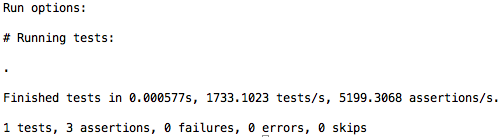

> [点击查看配套源码][src]。可通过添加微信公共帐号`icodekata`，或者微博帐号`姜志辉iS`与我讨论

mini_blog是模仿[jekyll][jekyll]的简易blog生成程序。

可以在[google][google]上搜索一下jekyll，推荐[阮一峰][ruanyifeng]的这篇，因为这篇非常简单，利于快速了解jekyll。

mini_blog的初衷是帮助初学者学习ruby，因此它比jekyll简单的多，只提供了一些必要的核心功能。这些功能模仿项目的实际情况采用迭代的方式，一步一步由浅入深，循序渐进。

让我们看一下这个版本的大致功能：

使用者只需要在_posts目录下完成markdown格式的blog文件。系统会自动将其转化为_site目录下的html文件。

- 可以将_layouts下的default.html文件作为布局模板
- 能够将md格式的文件转化为html格式
- 根据_posts下的md文件自动生成index.html首页文件
	
另外，作为一名程序员，我们怎么可以容忍大量的重复性手工劳作？所以：
	
- 使用命令`ruby blog.rb create blog_name`，自动生成blog框架结构
- 根据工作目录，自动生成_site静态博客站点

我们可以将这个案例分解为以下几个用户故事。

##用户故事1: 自动生成blog框架结构

框架结构不用太复杂：
_layouts、_posts为工作目录。其中_layouts为布局模板目录，其中会提供一个默认的default.html页面布局文件；_posts目录用来存放博客。
_site目录是根据工作目录自动产生的生产目录。其中包括首页index.html和根据md生成的blog页面。

从功能上来说，我们可以将这个故事分成两个任务：1、创建目录；2、创建文件

###任务1：创建目录

mini_blog需要两个工作目录：_layouts和_posts；一个生产目录_site

让我们先为这个任务添加一个测试场景(blog_test.rb):
	
	require "test/unit" #引用test/unit，使用ruby自带的单元测试

	def create_dir(dir_name)
		#在此完成你的代码
	end

	class BlogTest < Test::Unit::TestCase  #定义一个单元测试类BlogTest
		def test_create_dir	#定义一个测试create_dir的方法,测试需要以test开头
			site_dir = "_site"
			layouts_dir = "_layouts"
			posts_dir = "_posts"

			create_dir(site_dir)		#create_dir是我们需要完成的代码
			create_dir(layouts_dir)
			create_dir(posts_dir)
		
			assert Dir.exist?(site_dir)			#验证_site目录存在
			assert Dir.exist?(layouts_dir)	 	#验证_layouts目录存在
			assert Dir.exist?(posts_dir)		#验证_posts目录存在
		
		end
	end

先来了解一下ruby中帮助的使用。

通过`ri Dir`查看关于Dir类的帮助。回车键可以读取下一行，使用`q`键退出。关于ri环境的安装可以查看[这里][readme]。

`irb`环境可以帮助我们测试实验代码。

	Dir.mkdir '_site'
	Dir.exist?'_site'

使用`exit`退出irb。

查看Dir类，找到我们需要的方法mkdir。使用`ri Dir.mkdir`查看更详细的信息(注意大小写，Ruby是区分大小写的)。在create_dir方法中完成你的代码,保存该文件为blog_test.rb。

如果你完成了create_dir方法。可以使用`ruby blog_test.rb`文件来执行这个测试。如果正确，显示界面应该如下:

`.`表示测试通过。

希望大家自己完成create_dir方法。

如果需要和我的代码对比，它可能是这样：

	def create_dir(dir_name)
		Dir.mkdir dir_name unless Dir.exists? dir_name
	end
	
`unless`和`if`相反，是在条件不满足时执行。如果执行语句只有一行，则可以将条件语句后置。

还有一个很酷的地方，就是ruby的方法可以不用加()，比如`Dir.mkdir dir_name`和`Dir.mkdir(dir_name)`是等效的。我个人很喜欢这种写法，看起来非常自然。比如`create_blog my_blog`。我想这也是很多人将ruby设置为DSL首选语言的原因。

#### String.split

这个任务算不算完成了？嗯，好像还差点东西。比如真实的情况下还有这样的目录：`my_blog/_layouts`。所以更改一下我们的测试场景：

	require "test/unit"

	def create_dir(dir_name)
		# 在此修改你的代码
	end

	class BlogTest < Test::Unit::TestCase
		def test_create_dir
			blog_dir = "test_blog"
			site_dir = File.join blog_dir,"_site"
			layouts_dir = File.join blog_dir,"_layouts"
			posts_dir = File.join blog_dir,"_posts"

			create_dir(site_dir)
			create_dir(layouts_dir)
			create_dir(posts_dir)
		
			assert Dir.exist?(site_dir)
			assert Dir.exist?(layouts_dir)
			assert Dir.exist?(posts_dir)
		end
	end

现在我们目录中开始有了`/`(windows下应该是\),在创建目录的时候，应该先创建根目录，然后是子目录。比如`my_blog/_layouts`，应该先创建my_blog，然后才是my_blog目录下的_layouts目录。

使用split方法可以将字符串分隔成集合，`ri String.split`可以查询split的方法(请养成随时使用ri查看帮助的情况，以后不会再特别说明)。那么如何使用集合呢？

#### 代码块

Ruby中集合的循环处理与其它语言不太一样。哪里不太一样？这要从代码块说起。

有时做某一项操作时(比如创建文件)，并不知道用户会如何操作这个文件。操作序列是知道的，仅仅是其中的某一步操作我们并不了解，这个时候我们可以使用代码块让程序变得更灵活。

	def my_method
		puts "open file"	#先打开一个文件
			yield			#不知道如何操作，交给用户后期绑定
		puts "close file"	#最后关闭文件
	end

	my_method{puts "write file"}	#将写文件这事后期绑定给my_method的yield
	
`yield`就是交给用户自主的操作。如`{puts "write file"}`。

但是如果用户没有提供后期的操作怎么办呢？我们可以使用`if block_given?`来进行判断。而且我们也还可以为用户的后期操作绑定参数：

	def my_method
		puts "open file"
		yield "this's args" if block_given? #将"this's args"作为参数传递给代码块
		puts "close file"
	end

	my_method{|args| puts args}	#|args|中的args即是"this's args"

其中{}描述的代码块也可以使用do...end来表示。一般情况下，在单行的时候我们习惯使用{}；而在多行的时候我们使用do...end。如：

	def my_method
		puts "open file"
		yield "this's args" if block_given? #将"this's args"作为参数传递给代码块
		puts "close file"
	end

	my_method do |args|
		puts args
	end	#do...end 等同于 {}
	
Ruby的内部循环处理就采用了代码块的方式：

	['a',1,'b',2].each do |item|
		puts item
	end
	
each方法会对数组进行循环操作，但是如何处理则交给`do...end`块去完成，在此我们只是将其打印出来。

只是打印出来？为什么不做处理？当然要做处理，不过那是交给你来完成的。

#### 完成create_dir

还记得我们要干什么吗？先别着急往下看，完成`create_dir`方法针对`my_blog/_layouts`的情况。
	
这是我的结果：

	def create_dir(dir_name)
		path = []
		dir_name.split('/').each do |dir|
			path << dir
			dir_path = path.join '/'
			Dir.mkdir dir_path unless Dir.exists? dir_path
		end
	end
	
即然可以根据`my_blog/_layouts`的样式生成目录。那么请思考一下。如果同样给你一个`my_blog/_layouts`的样式，删除这些目录应该怎么搞定？思考一下，算是一个课外题吧。答案可以在后面的章节或者源码中寻找，它用到了递归。

###任务2：创建文件

mini_blog需要完成`_layouts/default.html`和`_site/index.html`两个文件。

`File.open 文件名,mode`可以帮助我们。mode参数可以使用'r'或者'w'来分别表示读和写：

	File.open('test.txt', "w") do |file|
		file.puts "Hello"
		file.write "World"
	end

如你所见，File.open采用的也是代码块。它可以提供给我们更大的灵活性。mini_blog决定使用`create_file(file_path,content)`的函数签名。file_path代表文件路径，而content则代表文件的内容文本。不使用代码块是因为html的文件内容由程序生成总不是一个很好的方法。微软同学的Asp.net就是一个工作量很大的实现。html的创建为什么不交给专业人士搞定呢。我们只需要获取这些内容然后将它写入文件就可以了。

写文件本身调用的是Ruby最底层的File.open代码：

	def create_file(file_path,content)
		File.open(file_path, "w") do |file|
			file.write(content)
		end
	end

	create_file('test.txt',"
this's my content
")

如果是'test.txt'这样的文件路径当然没有问题。但其实我们真正要写的是`my_blog/_layouts/default.html`和`my_blog/_site/index.html`这样的文件路径。如果`_layouts`目录不存在，需要先创建目录，然后才是`default.html`文件。	

让我们看看完成这个任务所需要的步骤：

- 获取`my_blog/_layouts/default.html`的目录`my_blog/_layouts`
- 如果`my_blog/_layouts`目录不存在，创建它
- 写入`default.h™l`文件

创建目录和文件已经搞定了，还差一个：获取文件路径的目录。

让我们添加这个场景的测试：
	
	require "test/unit"

	def get_dir(file_path)
		#在此完成你的代码
	end

	class BlogTest < Test::Unit::TestCase
		def test_get_dir
			file_path = "my_blog/_site/index.html"
			assert_equal "my_blog/_site",get_dir(file_path)
		end
	end

如果需要和我的代码对比，它可能是这样：

	def get_dir(file_path)
		arr = file_path.split '/'
		arr.pop
		arr.join('/')
	end

get_dir，加上create_dir和File.open，搞定下面这个测试场景应该不难吧？

	def test_create_file
		file_path = "test_blog/_site/index.html"
		create_file file_path,"hello,world"
		assert_equal "hello,world",File.open(file_path).readlines.join
	end
	
get_dir + create_dir + File.open = creeate_file:

	def create_file(file_path,content)
		dir_path = get_dir(file_path)
		create_dir dir_path unless Dir.exists?dir_path
		File.open(file_path, "w") do |f|
			f.write content
		end
	end

###任务3：完善BlogTest

让营地比我们来的时候更干净！

如果我们运行单元测试，会发现运行时生成的目录和文件并没有被删除，遗留在了系统中。对于有洁癖的程序员当然是无法忍受。不仅如何，遗留的系统没有被删除，当我们更改程序时，因为文件已存在，测试代码并不能如实的反映程序的真实情况。让我们来搞定这些事。

#### teardown

在单元测试类BlogTest中，添加teardown方法。teardown可以在每个测试方法运行之后自动被调用。将清理现场(单元测试时产生的目录和文件)的代码加入到teardown中，如下所示：

	def teardown
		blog_dir = "test_blog"
		site_dir = File.join blog_dir,"_site"
		layouts_dir = File.join blog_dir,"_layouts"
		posts_dir = File.join blog_dir,"_posts"
		[posts_dir,layouts_dir,site_dir,blog_dir].each do |dir|
			Dir.delete dir if Dir.exist? dir
		end
	end
	
运行测试。

OH！出错了，有没有？`Directory not empty - test_blog/_site`。问题出在运行`test_create_file`测试时，使用`create_file`在_site目录中创建了index.html文件。当删除_site目录时，_site目录并不为空。要想删除_site目录，必须将该目录中的文件清除：

	def teardown
		blog_dir = "test_blog"
		site_dir = File.join blog_dir,"_site"
		layouts_dir = File.join blog_dir,"_layouts"
		posts_dir = File.join blog_dir,"_posts"
		[posts_dir,layouts_dir,site_dir,blog_dir].each do |dir|
			next unless Dir.exist?dir 	#如果文件不存在，进入下一项
			files = Dir.entries(dir) - ['.','..']#获取目录中除去.和..之外的所有文件
			if files.length > 0	#如果目录中确实存在文件，删除它们
				files.each do |file|
					path = File.join dir,file
					File.delete path
				end
			end
			Dir.delete dir
		end
	end

Good!如果目录中有文件，删除那些文件,然后再删除目录。可是，如果目录中还有目录呢？就必须将刚刚的步骤再作一遍。将迭代中的代码提取出来，形成一个单独的函数。即有利用代码的复用，同时也使得代码更加容易读懂。

	def teardown
		blog_dir = "test_blog"
		site_dir = File.join blog_dir,"_site"
		layouts_dir = File.join blog_dir,"_layouts"
		posts_dir = File.join blog_dir,"_posts"
		[posts_dir,layouts_dir,site_dir,blog_dir].each do |dir|
			clear_dir dir
		end
	end

	def clear_dir(dir_path)
		return unless Dir.exists? dir_path

		files = Dir.entries(dir_path) - ['.','..']
		if files.length > 0
			files.each do |file|
				path = File.join dir_path,file
				if Dir.exists?(path)
					clear_dir(path)	#如果是目录，递归调用clear_dir
				else
					File.delete path
				end
			end
		end
		Dir.delete dir_path
	end
	
等等，既然`clear_dir`方法可以删除目录，也包括目录下的所有目录。那么teardown方法何必那么麻烦呢？只需要：

	def teardown
		blog_dir = "test_blog"
		clear_dir blog_dir
	end
	

#### setup

DRY,不要重复你自己。单元测试中有很多重复的代码应该被提取出来，比如`blog_dir = "test_blog"`这种多处出现的变量应该被归置在一个指定的地点。与teardown相反，setup则是在每个测试运行之前自动调用，常常用来初始化在测试中需要使用到的变量。我们可以将所有定义默认目录和文件的变量归置在setup方法中。但需要使用@符来定义变量。因为默认方式定义的变量只存于定义的函数生命周期内，这意味着在其它函数中无法访问。如果使用@定义变量，那么该变量将会存在于对象的整个生命周期内。所以，我们也可以直接将@声明的变量称之为对象变量。更改后的代码如下：

	class BlogTest < Test::Unit::TestCase
		def setup
			@blog_dir = "test_blog"
			@site_dir = File.join @blog_dir,"_site"
			@layouts_dir = File.join @blog_dir,"_layouts"
			@posts_dir = File.join @blog_dir,"_posts"
			@file_path = File.join @site_dir,"index.html"
		end
		def teardown
			clear_dir @blog_dir
		end
		def test_get_dir
			assert_equal @site_dir,get_dir(@file_path)
		end
		def test_create_file
			create_file @file_path,"hello,world"
			assert_equal "hello,world",File.open(@file_path).readlines.join
		end
		def test_create_dir
			create_dir(@site_dir)
			create_dir(@layouts_dir)
			create_dir(@posts_dir)
			assert Dir.exist?(@site_dir)
			assert Dir.exist?(@layouts_dir)
			assert Dir.exist?(@posts_dir)
		end
	end
	
### 任务4：将逻辑代码与测试代码分离

将逻辑代码和测试代码放置在一起，很显然违背了单一职责原则(一个元素应该只有一个使其发生变化的原因)。无论是逻辑还是测试代码任何部分发生变动时，都会造成blog_test.rb文件发生变化。因此，需要将逻辑代码和测试代码放置在不同的文件中。从blog_test.rb中将逻辑代码提取出来，保存为blog.rb文件：

	def create_dir(dir_name)
		# ...
	end

	def get_dir(file_path)
		# ...
	end

	def create_file(file_path,content)
		# ...
	end

	def clear_dir(dir_path)
		# ...
	end
	
blog_test.rb需要使用到blog.rb中的逻辑，因此，需要在测试代码中添加对blog.rb文件的引用：

	require "test/unit"
	require "./blog"

	class BlogTest < Test::Unit::TestCase
		def setup
			# ...
		end
		def teardown
			# ...
		end
		def test_get_dir
			# ...
		end
		def test_create_file
			# ...
		end
		def test_create_dir
			# ...
		end
	end
	
### 任务5：自动生成blog框架结构

#### 支持`ruby blog.rb create blog_name`格式

Ruby将命令行参数保存在一个名为ARGV的字符串数组中。例如`ruby blog.rb create blog_name`，在blog.rb中，ARGV[0]表示字符串"create",ARGV[1]表示字符串"blog_name"。

在`blog.rb`文件的底层尝试ARGV的应用：

	ARGV.each do |arg|
		puts arg
	end
	
要支持`ruby blog.rb create blog_name`，需要验证ARGV的长度，如果不等于2或者ARGV[0]不等于"create",需要给用户提示：

	def check_usage
		unless ARGV.length == 2 && 'create' == ARGV[0]
			puts "Usage: `ruby blog.rb create app_name`"
			exit
		end
	end
	check_usage
	
现在命令行运行`ruby blog.rb create my_blog`检验check_usage的效果。

但是…试试运行`ruby blog_test.rb`(blog_test.rb文件require了blog.rb文件)。

啊噢！这可不是我们想要的效果。我们需要： 

- 使用`ruby blog.rb create my_blog`时，执行check_usage方法
- 使用`ruby blog_test.rb`,blog.rb被当作类库require时，并不需要执行check_usage方法

其代码如下：

	def check_usage
		# ...
	end
	if $0 == __FILE__
		check_usage
	end

`$0 == __FILE__`判断文件正在怎样被使用。变量$0表示在命令行里出现的脚本名字(对于使用C语言的同学应该比较熟悉)，__FILE__(前、后各两个下划线)表示脚本的名字。当`blog.rb`作为脚本运行时，这两者会相等。但是作为类库被require时，$0和__FILE__并不相等。

当blog.rb作为脚本运行时，`ruby blog.rb create my_blog`将会作以下操作：

- 创建blog的目录结构
- 创建`blog_name/_layouts/default.html`文件

#### 创建blog的目录结构

blog需要两个基本目录：_layouts和_posts。当我们使用`ruby blog.rb create blog_name`时，需要创建blog_name、blog_name/_layouts、blog_name/_posts三个目录。

添加针对这三个目录的场景测试：

	def test_create_dirs
		create_dirs @blog_dir
		assert Dir.exist? @blog_dir
		assert Dir.exist? @layouts_dir
		assert Dir.exist? @posts_dir
	end
	
尝试完成create_dirs方法。

我的完成版本如下：

	def create_dirs(blog_name)
		blog_dir = blog_name
		layouts_dir = File.join blog_dir,"_layouts"
		posts_dir = File.join blog_dir,"_posts"
		[layouts_dir,posts_dir].each do	|dir|
			create_dir dir
		end
	end
	
#### 创建`blog_name/_layouts/default.html`文件

需要有一个专门创建默认布局文件的方法吗？

如果没有这个方法，那么创建默认布局文件的代码片断将和`create_dirs`函数处在同一个层次上。很显然它们的粒度是不一致的。

如果需要，它看起来应该是这个样子：

	def test_create_default_layout
		create_default_layout @blog_dir,'test'
		assert File.exist? @default_layout
		assert_equal 'test',File.open(@default_layout).readlines.join
	end
	
`@blog_dir`之前在setup中已经被定义过了。同时将`@default_layout`变量添加到setup方法中：

	def setup
		@blog_dir = "test_blog"
		@site_dir = File.join @blog_dir,"_site"
		@layouts_dir = File.join @blog_dir,"_layouts"
		@posts_dir = File.join @blog_dir,"_posts"
		@default_layout = File.join @layouts_dir,'default.html'
		@file_path = File.join @site_dir,"index.html"
	end
	
完成create_default_layout方法，使测试通过：

	def create_default_layout(blog_name,content)
		blog_dir = blog_name
		layouts_dir = File.join blog_dir,"_layouts"
		default_layout = File.join layouts_dir,'default.html'
		create_file default_layout,content
	end

#### 创建`blog_name/_layouts/default.html`的简易内容

作为默认的布局模板，_layouts目录下的default.html应该精彩至极。可是...但是….

好吧，我们并没有那么酷的界面设计师。怎么办？

把你的故事讲的更漂亮一点，然后找个天使投资人，拿钱组建一个很酷的团队，再然后你就改变世界了。Fuck,如果你有这样一个思路，那么恭喜你，已经进入250俱乐部了。

我没那么天真。我的哲学是当没有合适的伙伴时，先把能做的做好。

比如default.html，如果没有那么酷的布局模板，一个可以打20分的简单模板应该也不错：

	def test_get_default_layout_content
		default_content = get_default_layout_content
		assert default_content.include? "{{content}}"
	end
	
"{{content}}"是我们定义的关键字(为什么会定义它为关键字，见后面“支持布局”的章节)。它会在渲染的时候被blog的内容替代。

在没有更酷的界面设计师加入我们之前，先来实现一个简单的布局页面吧：

	def get_default_layout_content
		content = []
		content << "<html><head><meta charset='utf-8'/><title>my_blog</title></head><body>"
		content << "<h1>My Blog</h1>
"
		content << "{{content}}"
		content << "
</body></html>"
		content.join
	end

如果，我们的用户越来越多，那么请他来设计一个炫的过火的html文件，我并不介意。只需要从那个设计中读取内容即可。

	def get_default_layout_content(*args)
		if args.length == 1
			File.open(args[0]).readlines.join
		else
			content = []
			content << "<html><head><meta charset='utf-8'/><title>my_blog</title></head><body>"
			content << "<h1>My Blog</h1>
"
			content << "{{content}}"
			content << "
</body></html>"
			content.join
		end
	end

#### 完成`ruby blog.rb create blog_name`

为create方法创建一个合理的测试场景：

	def test_create
		create @blog_dir
		assert File.exist? @default_layout
		assert_equal get_default_layout_content,File.open(@default_layout).readlines.join
	end

然后搞定它

	def create(blog_name)
		create_dirs blog_name
		create_default_layout blog_name,get_default_layout_content
	end

##用户故事2: 将md转化为html

用[MD][markdown]格式来写博客，使得写作者可以醉心于博客的内容，不用过于关注博客的显示样式。系统会自动搜索_posts目录下的所有md文件，将其转化为_site下的html文件。考虑到浏览器里的显示，我们希望采用`website/blog_name`而不是`website/blog_name.html`的样式。所以生成的html文件路径应该是`_site/blog_name/index.html`格式。

###任务1：读取所有md文件

Ruby为集合的处理提供了大量的方法，比如 `Array.each`、`Array.map`、`Array.collect`…，在`irb`中尝试它们的具体使用。重点尝试Array.select方法：

	result = [3,66,12,77,4,32].select do |item|
		item if (item > 10)
	end

	puts result
	
如上例所示，select方法可以从集合中提取符合条件的项组成新的集合。或许我们可以从_posts目录中利用select方法选择符合条件的文件。

如何从一堆文件中选择md文件呢？或许正则表达式可以帮助我们。说到正则表达式，我们可以试试如何在一堆的方法列表中获取我们需要的方法。让我们进入`irb`环境。

尝试输入`File.methods`，会看到大量的方法列表，然后在一堆的方法列表中寻找需要的方法确实不太方便。我们可以使用正则表达式。比如我们想找到以`to_`开头的方法可以尝试`File.methods.grep /^to_/`；如果想寻找以`name`结尾的方法，可以尝试`File.methods.grep /name$/`。那么如果我们记不得一个方法的具体名称，只记得这个方法名里面有一个`_`字符，可以尝试使用` File.methods.grep /^[0-9a-zA-Z]+_[0-9a-zA-Z]+$/`。`[0-9a-zA-Z]`表示可以是数字或者字母的任何一个匹配，`[0-9a-zA-Z]+`则表示可以有1到若干个数字或字母，如果使用`*`号，则表示可以有0到若干个数字或者字母。`_`就表示在这些数据或者字符中间必然有一个`_`字符。然而有一些字符属于特殊字符，如`.`就表示可以与任意字符相匹配，比如`File.methods.grep /./`其实和`File.methods`所得到的结果是一样的。如果我们确实需要查询一个包含`.`字符的方法，则需要为`.`加上`\`,就像这样`\.`,如果尝试`File.methods.grep /\./`则不会找到任何方法。

grep方法使用的是正则表达式。用`//`可以直接声明正则表达式，在`irb`环境中直接尝试`//.class`就可以证明这一点。在`//`中书写正则表达式可以通过`=~`查看是否与某个字符段相匹配。比如使用`puts "sample.txt" =~ /\.txt$/`可以找到sample.txt文本中与`\.txt$`匹配的位置，如果查找不到，则返回空。`/\.txt$/`表示该字符串是否以`.txt`结尾。

好了，让我们完成`is_md_file?`方法通过下面的测试：

	def test_is_md_file?
		assert !is_md_file?('text.txt')
	end
	
下面是我的实现，做个借鉴：

	def is_md_file?(file_name)
		file_name =~ /\.md$/
	end
	
使用`ri Dir`仔细查找，发现可以通过`dir = Dir.entries('_posts')`获取_posts目录下的所有文件,使用irb询问dir的类型`dir.class`,知道`Dir.entries('_posts')`返回的是一个字符串的数组，那么我们可以定义一个方法`get_mds(files)`来获取文件数组中所有的md文件。

整理一下思路，完成下面的单元测试：

	def test_get_mds
		md_file = 'c.md'
		result = get_mds(["a.txt",'b.html',md_file])
		assert_equal 1,result.length
		assert_equal md_file,result[0]
	end
	
这是我完成的代码：

	def get_mds(files)
		files.select do |file|
			is_md_file? file
		end
	end
	
### 任务2：将md转化为html

将博主的博客呈现给阅读者，常见的有两种方法。一种是将md文件转化为html文件，将html文件直接返回给阅读者。另一种是根据用户的选择从md文件中读取内容，根据上下文生成html返回给阅读者。我们在mini_blog里使用的是前者。

#### 将md的文件内容转化为html格式

那么如何将md的文件内容转化为html格式呢？使用`File.open`来读取md内容你应该早就想到了。让我们观察一下md的样式片断:`#这是H1##这是H2`不难判断`#`符号实际上对应的是html中的`<h1></h1>`,而`##`符号则对应的是html中的`<h2></h2>`标记。更多内容我们可以通过搜索引擎来查找markdown获取。
如果我们需要一个将md的文件内容转化为html形式的方法，采用正则表达式应该不难办到。不要想太多，试试用最简单的方法使下面的测试通过：

	def test_md_to_html
		md_content = '#content'
		html_content = "<h1>content</h1>\n"
		assert_equal html_content,md_to_html(md_content)
	end
	
为什么在预期值中多添加一个`\n`?因为`<h1>`不是更应该单独一行吗？无论是在html语法上，还是在格式的美观上。
我做了一个简单的实现，参考一下：

	def md_to_html(md_content)
		"<h1>#{md_content.sub('#','')}</h1>\n" if md_content =~ /^#/
	end

也就是说我们需要实现一个md到html文件的语法转化器。

Oh!My God!那我们需要把所有的标记全部做个对应。你当然可以做这件事，你行的，加油！我看好你噢。
至于我么。我不喜欢重复发明轮子。

通常情况下，可以尝试多几种查询是否有现成轮子的方法。比如搜索引擎，或者`gem search -r markdown`,又或者直接到这里`http://rubygems.org`。

说到markdown的轮子，我个人比较喜欢`rdiscount`.

通过`gem install rdiscount`安装rdiscount。这样我们就可以使用它了。如下所示：

	require "rdiscount"

	# …
	
	def md_to_html(md_content)
		RDiscount.new(md_content).to_html
	end
	
#### 将_posts中的md文件转化为_site目录下的html

我们需要在这个任务中将_posts中的md文件转化为"_site/md_文件名/index.html"。这个任务应该不太难。通过前面的md_to_html的方法将获取生成后的html内容写到_site目录下就可以了。

先不要看下面的内容，自己动手试试。

你是否发现了一个小问题：如果md格式的代码中有中文，就会出现乱码的现象。

是的，事情并不像我们想像的那么简单。在Coding的世界里，你不动手永远不知道会发生什么意想不同的问题。所以，无论是学习Coding还是实际工作，必须养成勤动手的好习惯。

在html中，如果有中文的话，需要使用`<meta charset='utf-8'>`在html页面中声明。因此在写文件时，需要先写入这个声明，然后再写入转换完成以后的html。如下所示：

	def md_to_html(md_content)
		“<meta charset='utf-8'>\n#{RDiscount.new(md_content).to_html}”
	end
	
不过暂时先不用往`md_to_html`里添加编码支持。因为最合适它的地点是默认布局文件default.html中(思考一下为什么？)。

##用户故事3：支持布局

博客系统当然需要支持布局。如果只是将md转化为html，那么谁来负责页面的显示效果呢？如果在md中完成页面效果，那么用户就不能专心于blog的书写。我们的blog程序当然尽可能让用户的使用更简单。再则，用户的blog也应该有一样的界面效果。看起来，我们为用户提供布局应该是个不错的想法。

###任务1：支持简单模板功能

不需要实现多么复杂的功能，那将会耗费你大量的时间。

这个功能非常简单，只需要固定好模板页面，在页面中预留出md博客的位置即可。正则表达式可以出场了。我们可以布局模板，预留给blog的部分采用特殊符号即可。常用的特殊符号如`<%= blog内容%>`，这次我们可以试试`{{blog内容}}`。

让我们回顾一下正则表达式的内容。还记得`=~`吗？可以用来检验字符串和正则表达式的匹配情况，比如邮箱的验证：` "ibagsoft_2013@gmail.com" =~ /^[a-zA-Z0-9][_a-zA-Z0-9]+@[a-zA-Z0-9]+\.[a-zA-Z0-9]+$/`。
让我们来看另外两个常用的方法：

#### match

`match = '<ul><li>a</li><li>b</li></ul>'.match /<li>.*?<\/li>/`获取的match对象即是匹配结果，可以通过`match.to_s 或者 match[0]`来获取匹配项。但是我们发现在刚刚的字符串里有两个li项。如果通过match方法进行匹配，往往只能找到第一个匹配项，如果需要找到全部的匹配项，match方法就不如scan擅长了。

#### scan

`match = '<ul><li>a</li><li>b</li></ul>'.scan /<li>.*?<\/li>/`则会扫描到所有的匹配结果。match对象获取匹配的数组结果。可以通过match[0]和match[1]来获得这两个匹配项。

让我们看看这个单元测试：

	def test_render
		layout_content = "
{{content}}
"
		blog_content = 'hello,world'
		html_content = "
hello,world
"
		result = render(layout_content,blog_content)
		assert_equal html_content,result
	end
	
尝试完成render方法。

下面是我的版本：

	def render(layout_text,blog_text)
		layout_regexp = /\{\{\s*(content)\s*\}\}/
		match = layout_text.match(layout_regexp)
		layout_text.sub(match.to_s,blog_text)
	end
	
###任务2：使用现有的模板库

刚刚简单的模板功能已经足够我们使用了。

如果需要更复杂的功能，可以使用现成的模板库。为了和jekyll保持一致，我们使用Liquid作为布局模板库。可以点击[这里][liquid]查看它的使用示例和源码。

使用`require "liquid"`引用liquid。如果没有liquid，使用`gem install liquid`安装它。

尝试liquid类库改写layout_render方法。

这是我更改后的完整版本：

	require "liquid"

	def render(layout_text,blog_text)
		template = Liquid::Template.parse(layout_text)
		template.render('content' => blog_text)
	end

## 用户故事4： 自动生成_site静态博客站点

使用`ruby blog.rb generate blog_name`可以从指定blog程序的_posts目录中找到所有的md文件，将其转化为html文件放置在_site目录下。

### 任务1：支持generate参数

在支持create参数的情况下，现在又多了generate参数。看起来我们必须对`check_usage`的方法作一些改动了。

	def check_usage
		unless ARGV.length == 2 && ['create','generate'].include?(ARGV[0])
			puts "Usage: `ruby blog.rb create|generate app_name`"
			exit
		end
	end	

### 任务2：自动生成博客文件

被转化的文件应该根据`_layouts/default.html`模板转化为`_site/md文件名/index.html`格式。
其测试代码如下：

	def test_create_blog
		create_file File.join(@posts_dir,@md_file),"#test"
		create_blog @blog_dir,@md_file
		blog_file = File.join File.join(@site_dir,@md_file.sub('.md','')),'index.html'
		assert File.exists? blog_file
		assert File.open(blog_file).readlines.join.include?("<h1>test</h1>")
	end

`create_blog`根据参数blog_name和md文件，从"blog_name/_posts目录"下获取md文件，将其转化为"blog_name/_site/md名称目录“”下的index.html文件。

	def create_blog(blog_name,md)
		md_path = File.join blog_name,"_posts/#{md}"
		blog_path = File.join File.join(File.join(blog_name,'_site'),md.sub('.md','')),"index.html" 
	
		md_text = File.open(md_path).readlines.join
		html_content = md_to_html(md_text)
		content = render get_default_layout_content,html_content
	
		create_file  blog_path,content
	end
	
代码看起来有点复杂。还需要根据blog_name和md自动组装成各种路径，其实这些路径是经常用到的，没有必要在多个地方重复组装。类可以帮助我们，不过这个主题我们会留在下一个主题讨论它。

### 任务3：生成index.html导航内容

如前所示，我们需要根据_posts目前下的md文件生成index.html导航内容。其测试场景如下：

	def test_index_content
		mds = ['a.md','b.md']
		result = index_content(mds)
		blog_regexp = /<a\s+href='.+?\/index.html'>/
		arr = []
		result.scan(blog_regexp) do |item|
			md_reg = /<a\s+href='(.+)\/index.html'>/
			arr << "#{item.match(md_reg)[1]}.md"
		end
		assert_equal [],mds - arr
	end
	
test_index_content在生成的导航内容中寻找含有指向生成的博客页面的链接，从而最大程度的包容最终的导航内容。因为我们的导航首页可以非常的华丽。不过，在我们的界面设计师没有到位之前，先实现一个20分的简单页面来测试我们的结果：

	def index_content(md_files)
		content = []
		content << "<ul>"
		md_files.each do |md_file|
			blog_dir = md_file.sub '.md',''
			content << "<li><a href='#{blog_dir}/index.html'>#{blog_dir}</a></li>"
		end
		content << "</ul>"
		content.join
	end
	
### 任务4：自动生成_site静态博客站点

让我们回顾一下生成静态博客站点的步骤：

1、获取所有的md文件

2、将所有的md文件转化为html文件

3、根据md自动生成index.html文件

	def generate(blog_name)
		mds = []
		mds = Dir.entries(@posts_dir) - ['.','..'] if Dir.exists?File.join(blog_name,"_posts")
		mds.each do |md|
			create_blog blog_name,md
		end
		content = render get_default_layout_content,index_content(mds)
		index_path = File.join @site_dir,'index.html'
		create_file index_path,content
	end

	
## 清理现场

现在我们有了create方法帮助我们创建blog默认的框架结构；而generate方法则根据这些工作目录自动创建_site站点。现在我们只需要一个判断就可以了，无论是create还是generate：

	if $0 == __FILE__
		check_usage
		method = ARGV[0]
		blog_name = ARGV[1]
		if method == 'create'
			create blog_name
		elsif method == 'generate'
			generate blog_name
		end
	end

试试看：

- `ruby blog.rb create my_blog`会调用create方法自动创建my_blog工作目录
- `ruby blog.rb generate my_blog`会调用generate方法自动生成_site站点(请确保你的_posts目录下有md博客)

OK,现在可以直接从_site目录中访问我们的网站了。辛苦了这么长时间，休息一下，感受编程的快乐吧！

	
[src]: https://github.com/ibagsoft/ruby_dota/tree/gh-pages/src/mini_blog_with_jekyll "src"
[jekyll]: https://github.com/mojombo/jekyll
[google]: http://203.208.46.145
[ruanyifeng]: http://www.ruanyifeng.com/blog/2012/08/blogging_with_jekyll.html
[readme]: https://github.com/ibagsoft/ruby_dota/blob/gh-pages/readme.md
[markdown]: https://zh.wikipedia.org/wiki/Markdown
[liquid]: https://github.com/Shopify/liquid